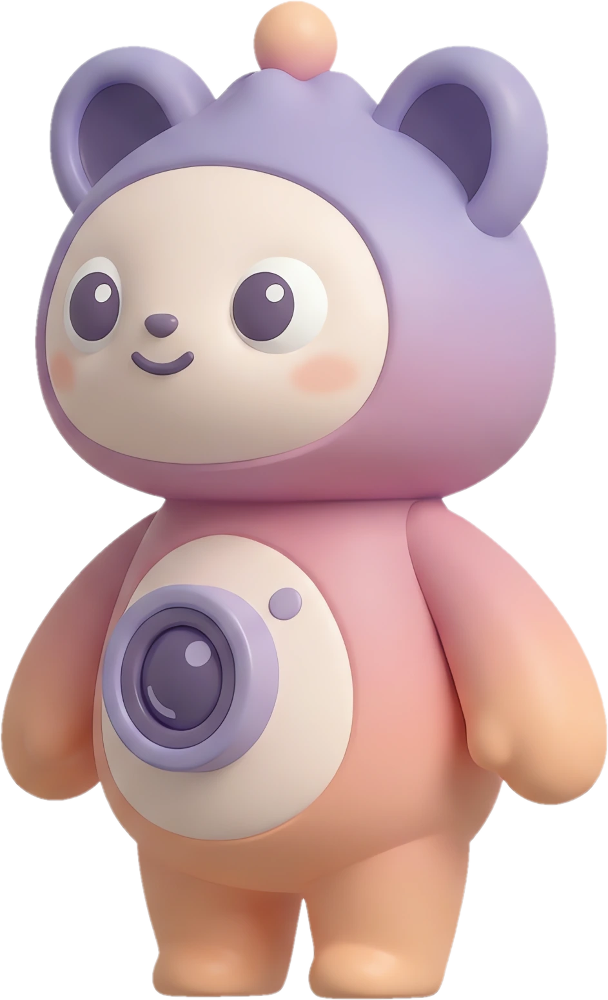
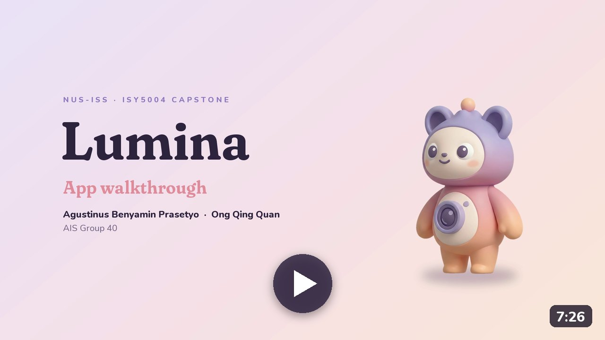
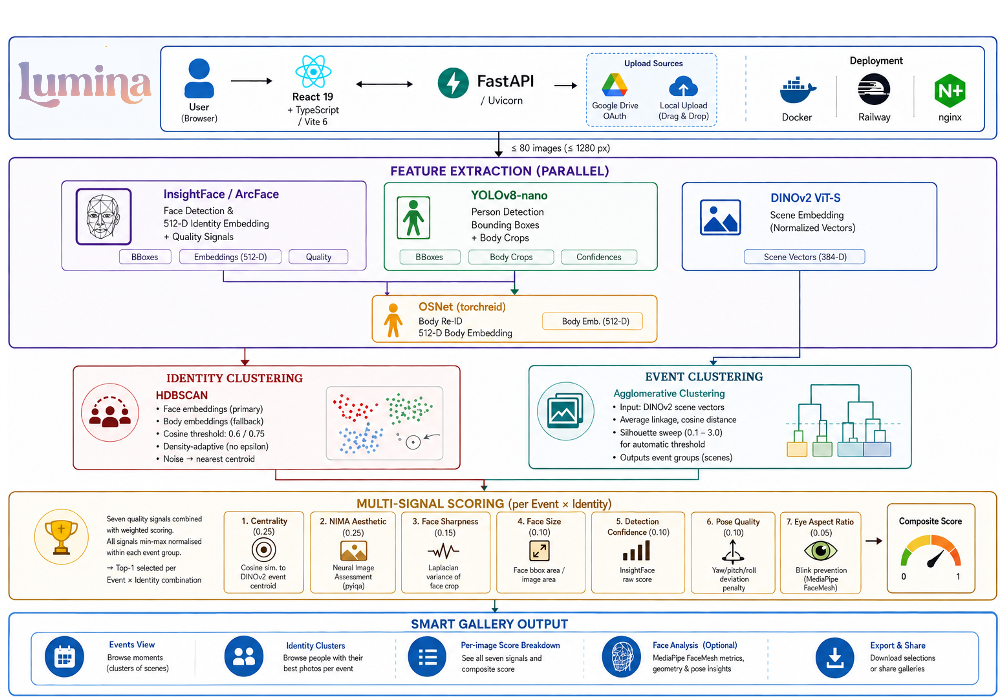

<div align="center">



# Lumina

**Your best photos, found for you.**

Lumina sorts a pile of photos into events and people, picks the best shot of each person at each event,
and tells you why it chose it.

[Live demo](https://luminaphoto.up.railway.app/) ·
[Product video](https://youtu.be/rqZu26yoBlM) ·
[App walkthrough](https://youtu.be/ES735eLGOpM) ·
[Presentation video](https://youtu.be/63fbOCV3cN4) ·
[Technical paper](report/lumina_technical_paper_with_humantest.pdf) ·
[Slides](Final%20presentation/Lumina_Capstone.pptx)

</div>

---

## What Lumina does

Drop in up to 200 photos from a trip, a wedding or a family weekend. Lumina will:

- **Group them** into events, shown in the app as *moments* (the beach day, the dinner, the graduation), and name each one.
- **Recognise the people** in them, even when a face is turned away, and cluster each person across the set.
- **Pick the best shot** of every person at every event, and explain the choice in plain words.
- **Clean up.** Duplicates, blinks and blurry shots are set aside with the reason shown. Nothing is deleted until you confirm.
- **Search** the collection by description: "group hug", "sunset", "someone laughing".
- **Learn your taste.** When you swap in a photo you prefer, Lumina adjusts how it scores the next one.
- **Make something.** A designed, printable PDF album with Lumi holding the photos, a 1080p video cut to the
  beat, or a small 3D island where Lumi walks among your moments.

Everything runs on our own backend. Photos are never sent to a third party unless you press **Enhance**
or ask for AI-written album captions.

## Videos

<table>
  <tr>
    <td align="center" width="50%">
      <a href="https://youtu.be/rqZu26yoBlM"></a><br>
      <b><a href="https://youtu.be/rqZu26yoBlM">Product video</a></b> (1½ min)<br>
      <sub>A short introduction to Lumina and Lumi</sub>
    </td>
    <td align="center" width="50%">
      <a href="https://youtu.be/ES735eLGOpM"></a><br>
      <b><a href="https://youtu.be/ES735eLGOpM">App walkthrough</a></b> (7½ min)<br>
      <sub>The whole app, from upload to album, video and 3D world, with how the pipeline works</sub>
    </td>
  </tr>
</table>

---

## How it works



| Stage | What happens |
|---|---|
| **Upload and queue** | Photos are uploaded from the React app. The FastAPI backend queues the job on a single worker, since the ML models are shared and not thread-safe. Progress streams back over Server-Sent Events. |
| **Feature extraction** | Four streams run on every image: ArcFace (face identity and quality), YOLOv8 (people), DINOv3 (scene context) and CLIP (semantics). Body crops go through OSNet for re-identification, and MediaPipe blink blendshapes measure open eyes. Features are cached in SQLite by the image's SHA-256, so a photo is never analysed twice. |
| **Identity clustering** | Faces are matched to bodies, then each person gets a fused embedding weighted by how much the face can be trusted. Agglomerative clustering groups them; faceless detections join the nearest person by body appearance. |
| **Event clustering** | DINOv3 scene distances, blended with capture time, are clustered with a silhouette-tuned threshold. Each event is named by comparing its CLIP centroid to a prompt bank. |
| **Scoring and selection** | Seven quality signals produce a composite score, and a blink always loses to an open-eyes shot. The best shot is chosen per event and per person, with an explanation attached. |
| **Personalisation** | Your "use this one instead" swaps become pairwise preferences, learned into a personal weighting of the seven signals. |

The full method, with every operating point, is in the
[technical paper](report/lumina_technical_paper_with_humantest.pdf) (Section III).

### Identity clustering

1. Faces are assigned to person boxes one-to-one. A pair needs at least half the face inside the person
   box, and is scored by that overlap plus a head-position prior (face near the top centre of the box).
   Each body gets at most one face, so overlapping people in group shots stay separate.
2. Each face gets a fused embedding `e_fused = [√α·e_face ; √(1−α)·e_body]`. The square roots make
   cosine similarity in this space exactly the α-weighted blend of face and body similarity. `α` rises
   with ArcFace detection confidence and face size, from a floor of 0.7 up to 1, so a detected face
   always leads.
3. Agglomerative clustering (cosine distance 0.58, average linkage) runs over the fused embeddings.
   Faceless detections attach to the nearest identity by ReID centroid (Euclidean distance below 0.75),
   and HDBSCAN on ReID alone handles collections with no faces at all. A cluster is shown in the cast
   if it appears in at least two photos or has one large face, so bystanders stay out.
4. `identity_mode = fused | face_only | body_only` switches the ablations used in `backend/eval/`.

### Events

Each pair of photos gets a distance that blends scene and time: `0.65 × (1 − DINOv3 cosine) +
0.35 × min(|Δt| / 6 h, 1)`. Photos without an EXIF time fall back to the scene distance alone.
Agglomerative clustering (average linkage) sweeps the threshold from 0.05 to 1.0 in steps of 0.025 and
keeps the one with the best silhouette, stopping after ten steps without improvement. Who appears in a
photo is deliberately left out, so an identity mistake can't redraw an event. Each event's CLIP centroid
is compared against a 26-entry prompt bank, and a match at cosine 0.25 or above replaces "Event 3" with
a name such as "Beach" or "Graduation".

### Scoring

Seven signals, combined with these default weights:

| Signal | Default weight | Measures |
|---|---|---|
| Centrality | 0.25 | Closeness (Euclidean) to the event's mean DINOv3 embedding |
| NIMA | 0.25 | Aesthetic quality, 0 to 10 |
| Face sharpness | 0.15 | Laplacian variance of the face region |
| Face size | 0.10 | Face area relative to the image |
| Detection confidence | 0.05 | InsightFace detection score |
| Pose quality | 0.10 | Frontal score from yaw, pitch and roll |
| Eyes open | 0.10 | 1 − the stronger MediaPipe blink score; the lowest face in a group photo counts |

- **Floored normalisation.** Signals are min-max normalised within the event, but each range has a
  minimum span (for example 0.75 NIMA points), so a tiny difference inside a burst can't decide the
  winner. Eyes-open is absolute and never rescaled.
- **Blink rule.** A photo with a detected face and eyes-open below 0.45 ranks after every open-eyes
  photo in the event. If every frame is a blink, the best one still wins.
- **Per event**, the highest composite wins, with an explanation such as "sharpest face, eyes open, most
  representative of the scene; beat the runner-up mainly on pose".
- **Per event and person**, each person's photos are re-scored using that person's own face signals.
  This is the "best shot of each person at each event".
- **Cleanup** marks near-duplicates (DINOv3 cosine 0.965 or above, keeping the best-ranked copy),
  blurry faces and blinks, and shows the reason on each.
- **Highlights** use Maximal Marginal Relevance, `λ·relevance − (1−λ)·max similarity to selected`, with
  λ at 0.9, 0.7 and 0.45 for the Quality, Balanced and Diverse modes, up to six per event.

An optional facial geometry view uses MediaPipe FaceMesh (468 landmarks) for symmetry, proportions and
per-feature scores.

### Learning from you

Promoting a different photo to Best Shot is a pairwise observation: *this one beats that one*. Lumina
takes one Bradley-Terry SGD step (learning rate 0.2) over the difference between the two photos' signal
vectors, with an L2 pull (0.05) toward the defaults and a projection back onto the simplex, so a few
noisy swaps can't overwrite the ranker. The learned weights:

- are shown on the profile page as "My Taste", learned against default for each signal,
- can re-rank any session on demand (`POST /api/rescore/{jobId}`),
- are kept per user and never retrain the models.

In the 13-person study below, one pass of learning did not yet beat the default weights on held-out
questions (24 matches against 26).

Corrections are saved on the server and logged, and the log doubles as evaluation data. You can rename,
merge or split people, move photos between them, re-pin an event's best shot (which also feeds
preference learning), and rename or delete events.

---

## Evaluation

Measured on 55 of our own photos in 20 occasions (details in the paper, Section V; code in
[`backend/eval/`](backend/eval/README.md); the run is in `report/experiments/20260928-130909/`).

| Question | Result |
|---|---|
| Events | ARI 0.985 against our folder grouping, with a label-free threshold (the Semester 1 features reach 0.549) |
| People | 0 of 526 same-photo face pairs merged into one person, stability 0.973 under 80% subsampling |
| Blinks | Without the blink rule, 3 of 16 winners have closed eyes; with it, none |
| What moves the pick | NIMA alone changes 12 of 16 winners; centrality and sharpness 4 each; pose, face size or a ±20% weight change, none |
| Speed | Cold pass 82 s, cached repeat 1.9 s |

**Keep-one study.** Thirteen people picked the photo they would keep on 16 occasions (234 picks).
Lumina's displayed order scores 0.53 where a random pick scores 0.50: above chance, but not by much.
People also change their minds (16 of 26 repeat answers matched the first) and disagree with each other.
On one occasion all thirteen kept the wide group shot that Lumina ranked last, because everyone was in
it. That is why Cleanup explains every frame it sets aside rather than keeping a single winner, and why
"who is in the frame" is the next signal to add.

There are no identity labels and no public benchmark yet, so these results are indicative.

---

## Enhancement

Every best shot has an **Enhance** button. The photo goes to an OpenRouter image-edit model with a
tightly scoped retouch prompt, and the result is checked before you see it.

1. **Constrained prompt.** Only retouching is allowed: skin tone, blemishes, eyes, exposure, colour and
   noise. The prompt explicitly forbids reshaping features, slimming, de-ageing, changing ethnicity,
   re-framing and changing the aspect ratio.
2. **Identity check.** Every face in the original is matched to its closest face in the result with the
   same ArcFace model the pipeline uses. The weakest match becomes the score, so one changed face in a
   group shot is still caught.

| ArcFace similarity | Result |
|---|---|
| below 0.45 | Discarded, and the user is told why |
| 0.45 to 0.65 | Shown with a warning |
| 0.65 and above | Accepted, with the match percentage shown |
| no face found | Shown, marked as unverified |

The original is never overwritten. The card toggles between the two versions, one click reverts, and the
album can use either.

**A note on image models.** OpenRouter has two image endpoints, and only one of them edits photos.
`/chat/completions` with `modalities: ["image", "text"]` accepts an input image and returns an edited
one. `/images` is text-to-image only and silently ignores any input image. Asked to enhance a photo,
`openai/gpt-image-2.5-flare` (served only on `/images`) returned two people who were not in it.
`enhance.py` therefore refuses the models listed in `openrouter.MODELS_WITHOUT_EDITING` with a clear
error instead of returning an invented picture.

| Model | ArcFace identity | Cost per photo | Notes |
|---|---|---|---|
| `openai/gpt-5.4-image-2` (default) | 0.96 | ~$0.23 | Fixed output size, so non-square photos are re-framed |
| `google/gemini-3.1-flash-image` | 0.94 | ~$0.07 | Edits in place and keeps the aspect ratio |

The identity scores are spot checks from development. The paper does not evaluate retouching, and the
0.45 / 0.65 cut-offs were not fitted on a labelled retouch set.

---

## Albums

The **Album** button turns the current selection into a printable PDF.

- **Layout.** Each page places photos on a 12 × 12 grid with mixed spans, so one or two photos lead and
  the rest follow. Seventeen templates cover one to nine photos per page, each tiling the grid exactly
  (the tests check it cell by cell), and pages alternate templates so long albums don't fall into a
  single rhythm.
- **Themes.** Lumi (default), Midnight, Ivory, Blush, Mono, Forest and Paper. Each sets the palette, page
  gradient, grain, rule weight and display typeface together. Lumi prints every photo on a white
  rounded card over pastel shapes; Paper is flat, with hairline rules and square corners.
- **Lumi in the album** (when "Bring Lumi along" is on). The cover shows the first photo in Lumi's hug,
  with two more as taped polaroids. On each photo page, Lumi holds the largest photo in one of six frames
  chosen to suit its shape. Each chapter opens with Lumi dressed for that event, and the album closes
  with Lumi hugging a heart.
- **Chapters and cast.** Consecutive photos from the same event become a chapter with its own divider
  page. A cast page introduces everyone with circular portraits cropped around the detected face.
- **Captions and titles** (optional). A text model writes a short title for each photo and names the
  album from the real event labels and people. It is told never to invent places, dates or names, and
  falls back to the event labels if the call fails.
- **Type.** Fraunces for display and Nunito for text, both embedded (SIL OFL, `backend/assets/fonts/`).

Pillow handles gradients, crops, masks and shadows; ReportLab handles type, rules and page structure.
Composited slots are embedded as JPEG rather than PNG with alpha, which brought a three-page album from
about 9 MB to under 1 MB.

---

## Accounts and profiles

Lumina works without an account. Signing in with Google (through Supabase Auth) adds:

- **Sessions that last.** Anonymous sessions are deleted after 24 hours; signed-in sessions are kept
  for 30 days. Anything made in the same browser before signing in moves into the account.
- **A profile.** Choose a display name, a profile badge (a Lumi pose on a coloured background, or your
  own photo), an accent colour, Lumi's outfit, and the default album theme and enhancement style.
- **Session labels.** Rename sessions and star favourites.

Profiles, session labels and avatars live in Supabase, protected by row-level security so each user can
only read and write their own rows. Photos and analysis results stay on the Lumina backend, which
verifies the Supabase access token on each request. The schema is in
[`supabase/migrations/`](supabase/migrations/).

---

## Models

| Model | Role | Detail |
|---|---|---|
| InsightFace (ArcFace, buffalo_l) | Face detection and identity | 512-d embeddings plus quality signals |
| YOLOv8 Nano | Person detection | Body boxes for fusion and the occluded-face fallback |
| OSNet (torchreid) | Body re-identification | 512-d embeddings on 256 × 128 crops |
| DINOv3 ViT-S/16 (DINOv2 fallback) | Scene understanding | Event grouping |
| CLIP ViT-B/32 | Semantics | Text search and zero-shot event naming |
| Agglomerative clustering | Identities and events | Average linkage; cosine for identities, scene + time for events, silhouette-tuned |
| HDBSCAN | No-face fallback | Density-based clustering on ReID embeddings |
| NIMA (pyiqa) | Aesthetics | Composition, colour and exposure, 0 to 10 |
| MediaPipe Face Landmarker | Open eyes | Blink blendshapes for the eyes-open signal and the blink rule |
| MMR | Diverse selection | Tunable relevance and diversity |
| Bradley-Terry SGD | Preference learning | Personal weights from pairwise swaps |
| MediaPipe FaceMesh | Facial geometry | 468 landmarks |

## Engineering

| Area | Approach |
|---|---|
| Persistence | SQLite (`backend/lumina.db`) for jobs, results, feedback, preferences, the corrections log and the embedding cache. Sessions survive restarts. |
| Concurrency | One worker processes jobs in order. Jobs interrupted by a restart are marked failed. |
| Caching | Per-image features keyed by SHA-256, salted with a `cache_version` so pipeline changes invalidate old entries. Re-runs skip inference entirely. |
| Retention | An hourly sweep removes expired jobs and their photos (`JOB_TTL_HOURS`, `USER_JOB_TTL_HOURS`) and prunes the cache. |
| Auth | Supabase access tokens identify signed-in users; anonymous browsers use a client id. An optional shared secret (`LUMINA_API_KEY` / `VITE_API_KEY`) locks the API for public deploys. |
| Tests | `backend/tests/`: pytest units for fusion, MMR, IoU matching, explanations, preference learning, corrections, the store, bento tiling, PDF rendering, mascot pose selection, the identity guard and the OpenRouter client, plus API tests against a mocked pipeline and a mocked OpenRouter. |
| CI | GitHub Actions runs the backend unit tests and the frontend typecheck and build on every push. |
| Evaluation | `backend/eval/experiments.py` (identity, events, ranker ablations, timing) and `backend/eval/human_study.py` (keep-one study) produce the paper's numbers. See [`backend/eval/README.md`](backend/eval/README.md). |

<details>
<summary><b>API reference</b></summary>

| Endpoint | Purpose |
|---|---|
| `GET /api/health` | Health check |
| `POST /api/analyze`, `GET /api/analyze/{id}` | Start or poll an analysis |
| `GET /api/analyze/{id}/stream` | Progress as Server-Sent Events |
| `GET /api/sessions`, `GET /api/sessions/{id}`, `DELETE /api/sessions/{id}` | Session history |
| `POST /api/account/claim` | Move a browser's anonymous sessions into the signed-in account |
| `GET /api/photos/{jobId}/{photoId}` | Serve a stored photo |
| `POST /api/search/{jobId}` | CLIP text-to-image search |
| `POST /api/feedback` | Record a swap, update preferences, pin the choice |
| `GET /api/preferences`, `PUT /api/preferences`, `POST /api/preferences/reset` | Read, set or reset the taste profile |
| `POST /api/rescore/{jobId}` | Re-rank with personal weights |
| `POST /api/corrections/{jobId}` | Rename, merge, move, pin or delete |
| `POST /api/export/{jobId}` | Zip of the curated selection |
| `POST /api/enhance`, `GET /api/enhance/{id}` | Start or poll an enhancement |
| `GET /api/enhanced/{jobId}/{photoId}`, `DELETE …` | Serve or discard an enhanced photo |
| `GET /api/collage/themes` | Album themes and whether AI text is available |
| `POST /api/collage/{jobId}` | Download the PDF album |
| `POST /api/face-analysis`, `GET /api/face-analysis/{id}` | Facial geometry analysis |

</details>

## Stack

**Frontend:** React 19 and TypeScript, Vite 6, GSAP with ScrollTrigger for all motion (the landing film,
entrances, Lumi's reactions), Tailwind, Lucide icons, Supabase JS for sign-in and profiles.

**Backend:** Python 3.11, FastAPI and Uvicorn, PyTorch and Transformers, InsightFace, Ultralytics,
torchreid, pyiqa, MediaPipe, scikit-learn and hdbscan, SQLite, ReportLab and Pillow, OpenRouter for
enhancement and album text, pytest.

---

## Running Lumina locally

You'll need Node.js 18+ and Python 3.11+. An [OpenRouter](https://openrouter.ai) key and a
[Supabase](https://supabase.com) project are both optional: without them, enhancement, AI album text
and sign-in are switched off and everything else works.

```bash
# Frontend
cd frontend
npm install

# Backend
cd ../backend
python -m venv ../venv
../venv/Scripts/activate        # Windows; use ../venv/bin/activate elsewhere
pip install -r requirements.txt

# Start both (Windows)
cd .. && ./start.ps1
# or separately:
#   cd backend  && uvicorn server:app --reload    # http://127.0.0.1:8000
#   cd frontend && npm run dev                    # http://localhost:5173
```

### Configuration

`frontend/.env.local`

```env
VITE_BACKEND_URL=http://127.0.0.1:8000
# VITE_SUPABASE_URL=https://<project>.supabase.co     # enables Google sign-in
# VITE_SUPABASE_ANON_KEY=...
# VITE_API_KEY=shared-secret                         # only if the backend sets LUMINA_API_KEY
```

`backend/.env`

```env
FRONTEND_URL=http://localhost:5173

# OpenRouter: enhancement, album titles and photo captions
OPENROUTER_API_KEY=sk-or-v1-...
OPENROUTER_BASE_URL=https://openrouter.ai/api/v1
OPENROUTER_TEXT_MODEL=openai/gpt-5.6-luna
OPENROUTER_IMAGE_MODEL=openai/gpt-5.4-image-2

# Supabase: verifies signed-in users (same project as the frontend)
# SUPABASE_URL=https://<project>.supabase.co
# SUPABASE_ANON_KEY=...

# LUMINA_API_KEY=shared-secret     # lock the API for public deploys
# JOB_TTL_HOURS=24                 # anonymous session retention
# USER_JOB_TTL_HOURS=720           # signed-in session retention
# MAX_PHOTOS=200                   # per-job cap on the server (the web app also stops at 200)
```

### Setting up sign-in

1. Create a Supabase project and enable the Google provider under Authentication.
2. Add your frontend URL (for example `http://localhost:5173`) to the allowed redirect URLs.
3. Run [`supabase/migrations/20260926000000_profiles.sql`](supabase/migrations/20260926000000_profiles.sql)
   in the SQL editor, or `supabase db push` with the CLI. It is safe to re-run.
4. Put the project URL and anon key in both `.env` files above.

### Tests and evaluation

```bash
cd backend
../venv/Scripts/python.exe -m pytest tests -q
../venv/Scripts/python.exe eval/experiments.py "../report/Test Images" --out ../report/experiments
# keep-one study and the earlier harness: see backend/eval/README.md
```

## Deploying to Railway

One service runs everything: the root `Dockerfile` builds the React app and the FastAPI backend serves
it alongside the API on the same domain, so there is no CORS or backend URL to configure.

1. Create a Railway service from the repository, leaving **Root Directory** empty. Railway reads the root
   `railway.toml` and builds the root `Dockerfile`.
2. Set `OPENROUTER_API_KEY`, `SUPABASE_URL`, `SUPABASE_ANON_KEY`, `VITE_SUPABASE_URL` and
   `VITE_SUPABASE_ANON_KEY` (the last two are baked into the web app at build time, so redeploy after
   changing them). Optional: `OPENROUTER_SITE_URL`, and the `LUMINA_API_KEY` / `VITE_API_KEY` pair.
3. Generate a public domain under **Settings → Networking**. The server picks it up from
   `RAILWAY_PUBLIC_DOMAIN`; set `FRONTEND_URL` instead if you use a custom domain.
4. Attach a volume at `/data` (any path except `/app`, which holds the code). The server reads
   `RAILWAY_VOLUME_MOUNT_PATH` and keeps SQLite and uploaded photos there; without a volume every
   redeploy wipes all sessions.
5. Add the domain to Supabase's Site URL / allowed redirect URLs, and run the migrations in
   `supabase/migrations/`.
6. Check `GET https://<domain>/api/health` returns `{"status": "ok"}`.

The image installs CPU-only PyTorch and keeps compilers in a separate build stage. Model weights
(~2.5 GB) are downloaded on boot rather than baked in, which keeps the image under Railway's size limit;
the first `/api/health` takes a minute or two while they load. Setting `HF_TOKEN` speeds up the Hugging
Face downloads. Loading the models needs several GB of RAM, so give the service a plan with enough memory.

To run the frontend and backend as two services instead, point each at `/backend` or `/frontend` as its
Root Directory with **Config file path** `/backend/railway.toml` or `/frontend/railway.toml`, and set
`FRONTEND_URL` on the backend and `VITE_BACKEND_URL` on the frontend.

---

## Lumi, the mascot

<table>
  <tr>
    <td align="center"><br><sub>Hello</sub></td>
    <td align="center"><br><sub>Looking</sub></td>
    <td align="center"><br><sub>Beach</sub></td>
    <td align="center"><br><sub>Birthday</sub></td>
    <td align="center"><br><sub>Hiking</sub></td>
  </tr>
</table>

Lumi is a small bao-bun bear with a camera lens for a tummy who appears across the app and in the album.
Each event's CLIP label picks a matching outfit (`backend/mascot.py` `SCENE_POSES`, mirrored in
`frontend/lib/lumiScenes.ts`). The 30 poses, four colour outfits and album frames were generated once,
offline, by `tools/mascot/` (Gemini 3.1 Flash Image for poses and frames, Veo 3.1 Lite for the landing
film, Real-ESRGAN for upscaling) for about $2.60. The app never calls a model to draw Lumi.

---

## Repository contents

| Path | Contents |
|---|---|
| `frontend/` | React app, including Lumi's poses and the landing film frames in `public/` |
| `backend/` | FastAPI server, ML pipeline, album renderer, tests and evaluation scripts |
| `supabase/` | Database schema for profiles, session labels and avatars |
| `tools/mascot/` | The one-off scripts that generated Lumi, with the spending ledger |
| `report/` | Technical paper (`lumina_technical_paper_with_humantest.tex` and `.pdf`), its figures, the experiment run, the keep-one study form, and a superseded draft in `archive/` |
| `Final presentation/` | Final presentation slides (`Lumina_Capstone.pptx`) |
| `LUMINA_TUNING_RESEARCH_NOTEBOOK.ipynb` | Semester 1 research and tuning notebook, with notes on what the capstone changed |
| `Latex format/` | Semester 1 report (PDF and Word) and its LaTeX template |

<div align="center">
<br>

<br>
<sub>Lumi says thanks for reading.</sub>
</div>
